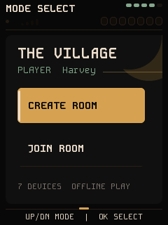
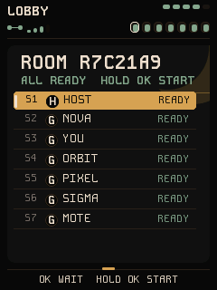
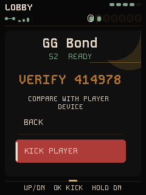
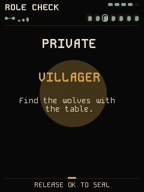
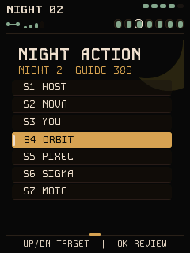
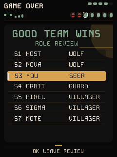

# Mote Werewolf · 狼人杀

**简体中文** | [English](README.en.md)

**Mote Werewolf（狼人杀）** 是运行在 7 台 FoloToy AI Passport 上的离线多人游戏固件。
一台设备创建房间并作为固定主机，另外六台通过 ESP-NOW 加入；开机直达游戏，
不依赖手机、路由器或云服务。

当前版本提供可构建、可测试的 MVP 纵向切片。规则由确定性 C 状态机裁决；
AI 仅保留为未来旁白能力，不参与角色、投票或胜负判定。

> **第一次玩狼人杀？** 从[玩家说明书：快速开局](docs/PLAYER_GUIDE.md)开始。
> 它只讲如何组队、看身份、完成一轮和判断胜负，不需要先读协议文档。

## 界面预览

以下画面由生产 LVGL 界面源码直接渲染，展示组队、玩家管理和游戏流程中的代表性页面。

| 模式选择 | 全员就绪 | 玩家详情 |
| :---: | :---: | :---: |
|  |  |  |
| 角色揭示 | 夜间行动 | 终局复盘 |
|  |  |  |

## 开发进度


**当前里程碑：P2 实体设备验收。** 软件纵向切片、10 项主机测试、100 状态生产 UI
模拟器和 ESP-IDF 构建门槛已经通过；双机已跑通建房、加入、准备、只读 `VERIFY`、
踢出与退房等组队主流程。最新的长身份排版和私密信息重复查看已通过主机/模拟器
验证，仍待重新上板验收。首版发布前还需完成三机多房间与丢包恢复、七机完整跑局，
以及串口和空口隐私审计。详细门槛见 [开发路线](docs/ROADMAP.md)。

## 当前功能

- 覆盖建房、房间列表、安全配对、准备、发牌、夜间行动、天亮、顺序发言、
  秘密投票、平票复投、胜负判定和终局翻牌。
- 顶栏常驻显示本机身份、公共阶段/回合、连接状态、真实 ESP-NOW 信号强度、
  七席状态与 CW2017 分格电量，不用文字挤占必要状态。
- ES8311 提供本地非阻塞提示音；音频故障会在内部记录并降级为静音，
  不影响规则状态机，也不在状态栏显示多余错误标签。
- 多房间环境使用稳定房间列表；昵称、`H/Y/G` 徽标和本地派生的只读
  `VERIFY` 码共同帮助玩家在线下确认当前链路。

## 固定玩法

- 固定 7 人：2 狼人、1 预言家、1 守卫、3 平民。
- 狼人每晚共同选择目标；意见不一致时有一次重选，仍不一致则当晚空刀。
- 守卫可以守自己，但不能连续两晚守同一座位。
- 预言家每晚查验一人，只得到“狼人 / 好人”阵营结果。
- 白天按座位顺序发言，所有存活玩家秘密投票；首轮平票后答辩并复投，复投再平票则无人出局。
- 狼人全部出局时好人胜；存活狼人数不少于其余存活人数时狼人胜。
- 死亡角色在游戏结束前不公开。

第一次开局请看[玩家说明书](docs/PLAYER_GUIDE.md)。完整且具约束力的规则见
[docs/MVP_RULES.md](docs/MVP_RULES.md)，协议与安全设计见
[docs/ARCHITECTURE.md](docs/ARCHITECTURE.md)，难度拆解和分阶段交付门槛见
[docs/ROADMAP.md](docs/ROADMAP.md)，统一三键操作见
[docs/CONTROLS.md](docs/CONTROLS.md)。板级事实和上板证据边界见
[硬件边界与验证指南](docs/AI_HARDWARE_DEVELOPMENT_GUIDE.md)，生产 UI 候选图与
隐私像素断言见[模拟器说明](simulator/README.md)。

## 操作

- 模式页：`UP/DOWN` 选择创建或加入，`OK` 确认。
- 房间列表：选择加入后会持续收集可见房间，不会自动加入第一个 `BEACON`；
  `UP/DOWN` 选择房间，`OK` 加入，长按 `DOWN` 取消并返回模式页。
- 大厅：昵称资料由主机加密回显后，焦点在本机行时短按 `OK` 只切换自己的
  `WAIT/READY`。房主用 `UP/DOWN` 选择包括自己在内的已加入座位；选中客机时
  短按 `OK` 进入玩家详情，查看只读码和 `BACK / KICK PLAYER` 菜单；菜单默认
  停在 `BACK`，选中 `KICK PLAYER` 后短按 `OK` 直接发起可靠踢出。列表徽标中
  `H` 是房主、`Y` 是当前客机自己、
  `G` 是其他客机；它们只表示界面身份，不是认证标记。
- 客机在 `ROOM` 信息下持续显示与房主这一条链路的六位只读 `VERIFY` 码；房主
  选中某位客机时在客机详情中显示同一条链路的码，供双方当面口头比对。码不提供
  按键确认，也不会产生确认状态；不一致时由客机主动离房，或由房主踢出该客机。
- Protocol/rules v5 只有在 7 个座位已占用、7 份昵称资料齐全、7 人全部
  `READY`，且房主持有 6 条加密客机链路时才允许长按 `OK` 开局。
- 客机在连接为 `ONLINE` 的大厅长按 `DOWN` 会直接发起可靠离房请求，随即锁定输入
  并等待 ACK 或有界超时，不再增加二次弹窗；`RECONNECTING` 期间当前输入锁定，
  等待恢复或有界 host-loss。房主长按 `DOWN` 打开关闭房间警告；该菜单
  明确提供并默认选中 `BACK`，短按 `OK` 可返回大厅，只有移到 `CLOSE ROOM`
  后长按 `OK` 才执行。
  关闭期间主机会先可靠通知已连接客机，
  客机显示 `ROOM CLOSED`，被单独踢出的客机显示 `REMOVED FROM ROOM`；两种通知
  都只有 `OK` 可返回模式页。客机主动离开、主机关闭房间
  以及主机异常终止都使用同一套可靠终止流程：等待 ACK 或有界超时后才拆除网络会话。
- 私密页：长按 `OK` 显示角色或查验结果，松手立即封屏且不提交；可以反复查看，
  确认记住后另短按一次 `OK` 完成。
- 选择页：`UP/DOWN` 选择座位，单击 `OK` 进入确认，再长按 `OK` 提交。
- 发言页：当前发言者长按 `OK` 提前结束发言。
- 终局页单击 `OK` 返回；错误页按界面提示重试或长按 `DOWN` 离开。

夜间操作和预言家私密结果保持静音；状态栏与提示音都不读取角色、阵营、私密目标
或个人提交进度。角色查看音对所有玩家一致，公共阶段音只在公共状态边沿播放。

昵称是最多 10 个可打印 ASCII 字符；超出部分会截断。昵称通过加密 `PROFILE` 消息
同步并由主机回显完整名单。昵称、座位号与 `H/Y/G` 徽标都是显示元数据；重名仍由
座位号区分，不能把这些界面信息当成对物理玩家身份的安全认证。

## 安全与可靠性边界

- 只有房间发现和建立 LMK 前的承诺/揭示握手使用广播；接受、准备、角色、行动、
  投票及结果均使用 ESP-NOW 加密单播。
- 主机每次只开放一个座位，并为每次尝试生成新的 X25519 密钥和随机数；双方先交换
  承诺，再揭示密钥材料，并把会话、座位、MAC、公钥、随机数与承诺绑定到同一份转录。
- 会话、座位、MAC、双方公钥、随机数和承诺共同绑定 HKDF，得到每个客户端独立的
  LMK；本实现还让同房设备从公开房间身份派生一致的 ESP-NOW PMK，避免依赖 SDK
  默认值或固化常量，但不把该 PMK 声称为保密/身份凭据。每次新尝试都使用新配对
  材料；房主在建房时创建 offer，并在成功配对、offer 超时或大厅玩家被移除/踢出后
  轮换，未配对客机的取消则由房主的有界 offer 超时收口。固件没有硬编码生产密钥。
- v5 从双方已有的握手转录和密钥材料本地派生同一六位只读 `VERIFY` 码。码不在包中
  传输，不记录人工确认状态，也不参与 `READY` 或开局门禁；只供双方当面比较。
  一致时可辅助人识别链路两端，不一致时由人离房/踢人。若玩家没有实际比对，系统
  仍只具备承诺绑定、X25519、独立 LMK 和加密单播，不能声称完成物理身份认证。
- 开局条件同时要求 7 个座位占用、7 份昵称资料齐全、7 人 `READY`，以及
  房主端 6 条客机加密链路完整；任意一项不满足都 fail closed。
- 传输层包含 ACK、有限重试、32 包重放窗口、动作幂等键和加密心跳快照。
- 已连接客机主动离开、主机关闭房间和主机异常终止统一进入可靠终止状态；终止消息
  首次入队失败会重试，网络会话保留至目标 ACK 或 9 秒有界期限，重试耗尽不能冒充 ACK。
- 当前 MVP 没有主机迁移和重启恢复。短时丢包可自动恢复；主机掉电、客户端重启或
  玩家永久离线会中止本局。
- 串口日志不输出角色、目标、投票、密钥或查验结果；NVS 初始化失败也不会自动擦除。

## 构建与测试

目标环境为 ESP-IDF 5.5.3、ESP32-C3：

```bash
source /path/to/esp-idf-v5.5.3/export.sh  # 替换为本机安装路径
idf.py set-target esp32c3                 # 首次配置或切换目标时执行
idf.py build
```

不要把 `idf.py flash` 视为普通构建步骤。烧录前必须确认实际串口、分区表和设备安全
状态，并取得明确的设备写入许可。

不依赖 ESP-IDF 的确定性测试可直接运行：

```bash
./tests/run_host_tests.sh
```

它覆盖规则状态机、帧协议与可靠传输、应用消息编解码、配对 KDF、有界房间目录、
可靠终止判定、v5 开局的 fail-closed 门禁和 UI 安全辅助逻辑。

界面候选图必须由生产 UI 直接渲染：

```bash
WEREWOLF_UI_OUTPUT_DIR=/tmp/werewolf-ui-candidate \
    bash simulator/preview.sh
```

当前模拟器会输出 100 个生产 UI 状态，并逐字节验证不同秘密的封闭页相同、松手恢复封闭页、
无匹配按下或私密 gate epoch 已变化的长按不能揭示秘密；普通心跳不会误取消同一
私密 gate 内的长按。候选图经视觉确认前不升级为 `current-*` 基线；模拟器确认不等于
物理屏幕已经验收。

## 项目结构

```text
main/werewolf_game.*       确定性权威规则状态机
main/werewolf_identity.*   NVS 昵称身份与一次性工厂 seed
main/werewolf_nickname.*   10 字符昵称规范化与校验
main/werewolf_protocol.*   固定字节序 ESP-NOW 帧格式
main/werewolf_net.*        加密对等端、ACK、重试、去重和心跳传输
main/werewolf_pairing.*    承诺/揭示、X25519、HKDF、LMK/PMK 与只读 VERIFY 派生
main/werewolf_messages.*   大厅及游戏应用消息编解码
main/werewolf_lobby.*      纯函数大厅验证与开局门禁策略
main/werewolf_room_directory.*  有界房间发现、稳定选择与陈旧项淘汰
main/werewolf_termination.*     可靠终止目标、重试与完成判定
main/werewolf_app.*        主机/客户端会话控制器
main/werewolf_power.*      CW2017 后台采样与陈旧值状态
main/werewolf_sound.*      ES8311 非阻塞短提示音队列
main/werewolf_ui.*         240 x 320 三键交互界面
main/werewolf_ui_text.*    公共阶段、链路与电量文本格式化
main/fonts/kode_mono/      与固件一同编译的 Kode Mono 字体及许可证
components/bsp/            AI-PASSPORT 显示、三键、音频、电量与共享 I2C BSP
simulator/                 直接编译生产 UI 的确定性 RGB565 渲染器
tests/                     Linux 主机测试
docs/PLAYER_GUIDE*.md      面向玩家的中英文快速上手说明书
partitions.csv             4 MiB 兼容的 2 MiB factory 分区（无 OTA）
```

## 上板验收

编译通过不等于硬件完成。正式交付至少还要依次完成：

1. 单机验证启动、三键边沿、长按/松手私密遮挡、栈与堆余量。
2. 三机验证多房间列表选择、双方只读 `VERIFY` 码一致且空口无该码、`H/Y/G`
   徽标、各自 `WAIT/READY`、房主定向踢人、客机主动离开/房主关房、加密对等端
   数量、丢包重试和主机失联中止。
3. 七机完整跑通所有角色、狼人重选、守卫连续守护限制、平票复投和两种胜负。
4. 抓取串口与空口证据，确认秘密不进日志/广播，并实测发现距离和丢包率。

当前界面中的回合秒数是目标时长提示，自动倒计时/超时推进以及 AI 语音旁白仍属于
下一阶段，不应在本版本中视为已完成。
