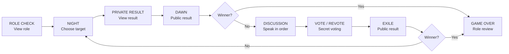

# Mote Werewolf Player Guide

[简体中文](PLAYER_GUIDE.md) | **English**

This guide is for players who are new to Werewolf or Mote Werewolf. The current
build always uses **seven players and seven FoloToy AI Passport devices**: two
Wolves, one Seer, one Guard, and three Villagers. The devices deal roles,
collect actions, count votes, and decide the winner. No extra moderator is
required, and the player who creates the room still plays normally.

> Want to start immediately? Read “Quick Start,” “Three-Button Cheat
> Sheet,” and “Viewing Private Information.”

## Quick Start

1. Give one device to each player and keep each screen facing its owner. Sitting
   in seat-number order is helpful because discussion follows that order.
2. One player selects `CREATE ROOM`. That device becomes the fixed Host, but its
   player still receives a random role.
3. The other six players select `JOIN ROOM`, choose the same room with
   `UP/DOWN`, and press `OK` to join.
4. In the Lobby, wait until this device's nickname appears and the footer offers
   `OK READY`. That means the Host has echoed this profile over the encrypted
   link. Do not keep pressing buttons while a sync/wait prompt remains.
5. A Guest may read the six-digit `VERIFY` code below `ROOM` to the Host. The
   Host selects that Guest and compares the code in the detail screen. Checking
   every link is recommended when several rooms or duplicate names are nearby,
   but it is not a device-enforced start requirement.
6. Each Guest presses `OK` in the Lobby to change from `WAIT` to `READY`. The
   Host first selects their own `H` row with `UP/DOWN`, then presses `OK` to
   become ready. The Host cannot ready another player.
7. Once all seven players are `READY`, the Host sees
   `ALL READY  HOLD OK START`. This also means all seven profiles and all six
   encrypted Guest links are present. The Host holds `OK` to start.
8. Do not swap, restart, or power off a device after the game begins. Each device
   remains bound to its seat until the review ends.

## Three-Button Cheat Sheet

| Input | Usual meaning |
|---|---|
| Short `UP/DOWN` | Move focus, change an option, or select a seat |
| Short `OK` | Select, become ready, enter review, or continue |
| Hold `OK` | Reveal private information or confirm a reviewed target |
| Hold `DOWN` | Back, cancel a review, or leave the room |

The key distinction is that, on night-action and voting screens, a short `OK`
only opens the review step. Holding `OK` submits the target. The footer always
shows the actions available on the current screen. `ACTION SENT / WAIT` means
the action is already submitted; wait for the other players instead of pressing
again.

## Reading the Lobby

- `H`: the Host.
- `Y`: this Guest’s own row (“You”).
- `G`: another Guest.
- `S1` through `S7`: game seats. Public results and speaking order use these
  seat numbers.
- `ROOM`: the room identifier shown in the room directory.
- `VERIFY`: a six-digit in-person comparison code for one Guest-to-Host link.
  Different Guests may have different codes. It has no confirmation button and
  does not affect `READY`.

The seven small blocks in the header represent the seven seats. A dim block is
empty, amber means joined but still waiting, and green means ready. After the
game starts, green means alive and a cut red block means eliminated. A light
outline marks this device’s seat. The nearby link and signal blocks show the
connection state; the rightmost segmented bar shows battery level.

If a `VERIFY` code does not match, the Guest can hold `DOWN` to leave, or the
Host can open that player’s detail screen and choose `KICK PLAYER`. Duplicate
nicknames are allowed; use the seat and `VERIFY` code to distinguish them.

## Viewing Private Information

Roles and Seer results use the same private-view flow:

1. Face the screen toward yourself and hold `OK` until the private content
   appears.
2. Keep holding while you read. Releasing `OK` seals the screen immediately but
   does **not** complete the page.
3. Hold `OK` again as many times as needed.
4. Once you remember the information, make a separate short `OK` press to send
   `DONE` and wait for the table.

As soon as you press `OK` to finish the page, this device enters its waiting
state and that secret cannot be reopened. Make sure you remember it first. Never
show your role, Wolf partner seat, or Seer result to another player.

| Screen text | Meaning |
|---|---|
| `PRIVATE SEALED` | The private content is hidden |
| `HOLD OK REVIEW` | You may hold again to review it |
| `OK DONE` | You have viewed it; short-press `OK` to finish |
| `WAITING FOR PLAYERS` | This device is done and is waiting for others |

## The Four Roles

### Wolf `WOLF`

- Goal: remain hidden until the living Wolves equal or outnumber all other
  living players.
- The role screen also shows the other Wolf’s seat.
- While both Wolves are alive, each chooses one living non-Wolf. They must choose
  the same target for that player to become the kill candidate. If only one Wolf
  remains alive, that Wolf's valid choice becomes the candidate directly.
- If their first choices differ, every living player receives one more night
  screen. If the Wolves disagree again, the Wolves kill nobody that night.

### Seer `SEER`

- A Good player who checks one other living player each night.
- The result is only `WOLF` or `GOOD`; it never reveals Guard versus Villager.
- A Seer killed during that night does not receive the new check result.

### Guard `GUARD`

- A Good player who protects one living player each night, including themself.
- If the protected player is also the Wolf target, that player survives.
- The Guard cannot protect the same seat on two consecutive nights. The same
  seat becomes legal again after protecting someone else for a night.

### Villager `VILLAGER`

- A Good player with no active ability that changes the night result. Villagers
  find Wolves through discussion and voting.
- Villagers still receive the night target screen and must submit a cover choice.
  This keeps every role’s visible interaction similar; the Villager’s choice
  does not affect the night result.

## One Complete Round

### 1. Role Check `ROLE CHECK`

Hold `OK` to view your role, then release to seal it. Review it again if needed.
When ready, make a separate short `OK` press to finish. Wolves must also remember
their partner’s seat.

### 2. Night Action `NIGHT ACTION`

Every living player acts so that observers cannot infer roles from the screen or
button activity:

1. Select an allowed target with `UP/DOWN`.
2. Short-press `OK` to review the seat and nickname.
3. Hold `OK` to submit, or hold `DOWN` to return and choose again.

If the night screen appears again immediately, it is not an error. The Wolves’
first choices differed, so the game is running its one hidden reselection. Every
living player acts again, but only the Wolves’ second choices affect the attack;
the Seer and Guard do not use their abilities a second time that night.

### 3. Private Result `PRIVATE RESULT`

Every device passes through this screen. Hold to view, release to seal, then make
a separate short `OK` press to finish:

- A living Seer sees the checked player’s `WOLF / GOOD` faction result.
- Everyone else sees `NO PRIVATE RESULT THIS NIGHT`. This is expected, not a
  device fault.

### 4. Dawn `DAWN`

The screen announces an eliminated seat or that nobody died. The role stays
hidden. Every device must short-press `OK` when it shows `OK CONTINUE`; discussion
starts after all devices acknowledge the result.

### 5. Discussion `DISCUSSION`

Living players speak in ascending seat order. Speak normally at the table; when
your turn is finished, hold `OK` to pass to the next player. Other players’
buttons remain paused. The device does not record or analyse speech.

`GUIDE 60S` is a suggested speaking duration, not a live countdown, and the
number does not change by itself. The current speaker must hold `OK` when done.

### 6. Secret Vote `SECRET VOTE`

Each living player votes for one other living player. Select with `UP/DOWN`,
short-press `OK` to review, and hold `OK` to submit. Votes remain private.
`GUIDE 45S` is a suggested voting duration and does not count down; every player
must still choose and submit manually.

If the highest vote is tied:

1. The tied players defend themselves in seat order and hold `OK` when done.
2. Every living player votes again, choosing only among the tied seats.
3. If the revote is tied, nobody is exiled that day.

### 7. Exile and Next Night `EXILE`

The screen announces only the exiled seat; the role stays hidden. `NO EXILE`
means nobody leaves. Every device presses `OK` to acknowledge the result. If no
side has won, the next round begins at Night.

## After Elimination

- An eliminated player cannot use a night ability, speak, or vote and receives
  no new secret result.
- Eliminated players still enter `PRIVATE RESULT` and see
  `NO PRIVATE RESULT THIS NIGHT`. They must still hold to view, release to seal,
  and make a separate short `OK` press to finish, or the table will keep waiting.
- The device also shows public Dawn, Exile, and Game Over screens. Follow every
  acknowledgement prompt so the table stays synchronized.
- Do not power off, restart, or take away the device. The current build requires
  all seven devices to stay online through the final review.
- Roles remain hidden until Game Over; players should not reveal themselves when
  eliminated.

## Winning and Final Review

- **Good wins** when every Wolf is eliminated.
- **Wolves win** when living Wolves equal or outnumber all other living players.
  For example, one Wolf versus one Good player is an immediate Wolf victory.
- The game checks victory after Dawn and Exile resolution.
- `GAME OVER` reveals every seat’s role. Press `OK` to leave after reviewing.
  If the Host is still delivering the review, wait until all devices receive it.

## Room Management

- A Guest holds `DOWN` in an `ONLINE` Lobby to leave and returns to the main
  screen when the reliable leave operation finishes. Active leave is currently
  unavailable while `RECONNECTING`.
- The Host selects a Guest with `UP/DOWN` and presses `OK` for details. The menu
  starts on `BACK`. Moving to the red `KICK PLAYER` item and pressing `OK` removes
  that player immediately without a second confirmation.
- The Host holds `DOWN` in the Lobby to open the close-room warning. Short `OK`
  activates the default `BACK` item. To close the room, select the red
  `CLOSE ROOM` item and hold `OK`.
- A kicked device shows `REMOVED FROM ROOM`; Guests see `ROOM CLOSED` after the
  Host closes the room. Press `OK` to return to the main screen.

## FAQ

### Why is the room list empty?

Confirm that the Host device has entered its room Lobby and remains powered on,
then keep the devices nearby and wait a few seconds for a beacon. If the list
stays empty, hold `DOWN` to return to Mode Select and enter `JOIN ROOM` again.
Do not press `OK` when no room entry is shown.

### Why is the table stuck on a waiting screen?

Check whether someone still needs to submit an action or acknowledge a role,
private result, Dawn, or Exile screen. `ACTION SENT / WAIT` and
`WAITING FOR PLAYERS` usually mean this device is finished and is waiting for
another one.

### Why does a Villager choose a night target?

It prevents observers from guessing roles based on who operates a device. The
Villager completes the same visible flow, but the choice does not change the
game result.

### Why did the night screen appear twice?

The Wolves’ first targets differed. This is the single hidden reselection; every
living player should complete the screen again.

### Why did the Seer receive no result?

Non-Seers normally see no private result. A Seer killed in that night also does
not receive the new result.

### Why do `GUIDE 60S / 45S` not change?

`60S` is the suggested speaking duration and `45S` is the suggested voting
duration. Neither is a timer. Automatic countdown and timeout advancement are
not implemented yet.

### What should I do on `RECONNECTING`?

Do not press anything while the header shows `RECONNECTING`; short packet loss
triggers automatic recovery. A few Lobby/private screens may currently retain
their normal footer during this state, but those actions are locked and should
not be followed. If the device later enters an `ERROR` page, follow its footer:
press `OK` for Retry or hold `DOWN` for Exit.

### Can the game continue after a restart or Host power loss?

No. The current build has no restart resume or Host migration. If any device
restarts, the Host loses power, or a player is permanently offline, leave the
game and create a new room.

## Rules Not Included in This Build

This ruleset has no Sheriff, Witch, Hunter, last words, Wolf self-reveal,
additional human moderator, automatic countdown, or AI narration. Do not add
rules from another Werewolf variant during a game because the device state
machine will not follow them.

This guide is a player-friendly explanation of the current seven-player build.
If a detail is ambiguous, the [normative MVP rules](MVP_RULES.md) and
[three-button control contract](CONTROLS.md) (Chinese) define the implementation.
