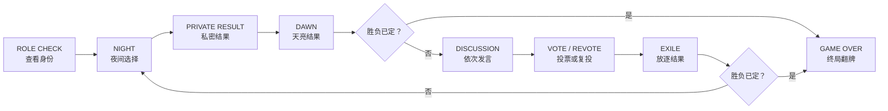

# Mote Werewolf 玩家说明书

**简体中文** | [English](PLAYER_GUIDE.en.md)

这是一份给第一次接触狼人杀和 Mote Werewolf 的玩家看的说明书。当前版本固定为
**7 人、7 台 FoloToy AI Passport**：2 名狼人、1 名预言家、1 名守卫和 3 名平民。
设备负责发牌、收集行动、统计投票和判断胜负，不需要额外安排法官；创建房间的玩家
仍然正常参与游戏。

> 只想马上开局：先读“快速开局”“三键速查”和“查看私密信息”三节即可。

## 快速开局

1. 七个人各拿一台设备，屏幕只朝向自己。建议大家按设备上的座位号围坐，后面会按
   座位号依次发言。
2. 任选一人选择 `CREATE ROOM`。这台设备成为固定房主，其玩家也照常获得随机角色。
3. 其余六人选择 `JOIN ROOM`，用 `UP/DOWN` 选中同一个房间，再短按 `OK` 加入。
4. 进入大厅后先等本机昵称出现，并确认页脚已经提供 `OK READY`；这表示本机资料已由
   房主通过加密链路回显，可以准备。仍显示同步/等待提示时不要反复按键。
5. 客机可将 `ROOM` 下方的六位 `VERIFY` 码读给房主；房主选中该玩家进入详情，确认
   两边号码相同。多房间或重名时建议逐一比对，但它不是设备强制的开局步骤。
6. 客机在大厅短按 `OK`，把自己从 `WAIT` 切换为 `READY`。房主先用 `UP/DOWN` 选中
   自己的 `H` 行，再短按 `OK` 准备；房主不能替其他玩家准备。
7. 七人全部 `READY` 后，房主屏幕出现 `ALL READY  HOLD OK START`；这也表示七份资料
   和六条加密客机链路已经齐全。房主长按 `OK` 开始游戏。
8. 开局后不要交换设备，也不要单独重启或关机；设备和座位会一直绑定到本局结束。

## 三键速查

| 操作 | 通常代表什么 |
|---|---|
| 短按 `UP/DOWN` | 移动焦点、切换选项或选择座位 |
| 短按 `OK` | 选择、准备、进入复核或继续 |
| 长按 `OK` | 查看私密信息，或确认已经复核过的目标 |
| 长按 `DOWN` | 返回、取消复核或离开房间 |

最重要的区别：在夜间行动和投票中，**短按 `OK` 只是进入复核，长按 `OK` 才会真正
提交**。屏幕最下方会一直显示当前可用操作；看到 `ACTION SENT / WAIT` 后说明已经提交，
等待其他玩家即可，不要反复按键。

## 大厅怎么看

- `H`：房主（Host）。
- `Y`：当前客机自己（You）。
- `G`：其他客机（Guest）。
- `S1` 至 `S7`：本局座位号；发言顺序和公开结果都以座位号为准。
- `ROOM`：房间编号，用于从房间列表找到同一桌。
- `VERIFY`：当前客机与房主之间的六位线下比对码。不同客机的码可以不同；它只供人
  当面核对，没有按键确认状态，也不影响 `READY`。

顶部七个小方块对应七个座位：暗色表示空位，橙色表示已加入但仍在 `WAIT`，绿色表示
已 `READY`；开局后绿色表示存活，带切口的红色表示出局。浅色描边标出本机座位。
旁边的连接图标和信号格表示当前联机状态，最右侧分格表示电量。

若 `VERIFY` 不一致，客机可在连接正常的大厅长按 `DOWN` 离开，或让房主进入该玩家详情后选择
`KICK PLAYER`。昵称可以重复，重名时以座位号和 `VERIFY` 为准。

## 查看私密信息

角色和预言家结果都使用同一种安全查看方式：

1. 把屏幕朝向自己，按住 `OK`，直到私密内容出现。
2. 保持按住即可阅读；松开 `OK` 会立即封屏，但**不会**提交完成。
3. 没记住可以再次长按查看，次数不限。
4. 确认记住后，另起一次短按 `OK`，提交 `DONE` 并等待其他玩家。

一旦短按 `OK` 完成本页，本机就会立刻进入等待，不能再打开这一条私密信息，因此先确认
自己已经记住。不要把角色、狼队友座位或预言家结果展示给其他玩家。

| 画面 | 含义 |
|---|---|
| `PRIVATE SEALED` | 私密内容仍被遮住 |
| `HOLD OK REVIEW` | 可以再次长按查看 |
| `OK DONE` | 已经看过，短按 `OK` 完成本页 |
| `WAITING FOR PLAYERS` | 本机已经完成，正在等其他设备 |

## 四种角色

### 狼人 `WOLF`

- 目标：隐藏身份，让存活狼人数达到或超过其余存活人数。
- 查看身份时还会看到另一名狼人的座位。
- 两名狼人都存活时，每晚各选一名存活的非狼人玩家；选择相同目标，狼刀才会锁定该
  玩家。只剩一名存活狼人时，该狼人的有效选择直接成为狼刀目标。
- 如果第一次选择不同，所有存活玩家都会再次看到夜间选择页。两狼第二次仍不一致，
  当晚狼人不会杀死任何人。

### 预言家 `SEER`

- 属于好人阵营，每晚查验一名其他存活玩家。
- 结果只会显示 `WOLF` 或 `GOOD`，不会告诉你对方是守卫还是平民。
- 如果预言家当晚被狼人杀死，则不会获得这一晚的新查验结果。

### 守卫 `GUARD`

- 属于好人阵营，每晚保护一名存活玩家，也可以保护自己。
- 被保护的玩家若同时成为狼刀目标，当晚不会死亡。
- 不能**连续两个夜晚**保护同一个座位；隔一晚后可以再次保护。

### 平民 `VILLAGER`

- 属于好人阵营，没有会改变夜间结果的主动技能，主要依靠发言和投票找出狼人。
- 平民晚上仍会看到目标选择页，也要按正常流程提交一次选择。这是用于隐藏角色差异的
  伪装行动，平民所选目标不会改变夜间结果。

## 一整轮怎么进行

### 1. 查看身份 `ROLE CHECK`

按住 `OK` 看自己的角色，松手封屏；可以重复查看。记住后另短按一次 `OK` 完成。
狼人同时记住队友座位，其他玩家只看到自己的信息。

### 2. 夜间选择 `NIGHT ACTION`

所有存活玩家都会操作，以免通过屏幕和按键判断角色：

1. 用 `UP/DOWN` 选择屏幕允许的目标。
2. 短按 `OK` 进入复核，重新确认座位和昵称。
3. 选择正确就长按 `OK` 提交；选错则长按 `DOWN` 返回重选。

夜间选择页如果很快再次出现，不是故障，而是两名狼人第一次目标不一致。所有存活玩家
再操作一次，但只有狼人第二次选择会影响狼刀；预言家和守卫不会重复发动本夜技能。

### 3. 私密结果 `PRIVATE RESULT`

所有设备都会经过这一页。仍然是长按查看、松手封屏、看过后另短按 `OK` 完成：

- 存活的预言家看到本夜查验目标的 `WOLF / GOOD` 阵营结果。
- 其他玩家看到 `NO PRIVATE RESULT THIS NIGHT`，这是正常状态，不是设备故障。

### 4. 天亮 `DAWN`

屏幕公布死亡座位，或显示本夜无人死亡；角色仍然保密。每台设备看到 `OK CONTINUE` 后
都要短按 `OK`，全员确认后才进入发言。

### 5. 依次发言 `DISCUSSION`

存活玩家按座位号从小到大依次发言。轮到自己时正常在桌面上讲话，结束后长按 `OK`
交给下一位；其他玩家的按键会暂停。设备不会录音，也不会分析发言。

屏幕上的 `GUIDE 60S` 只是发言建议时长，**不是真正的倒计时**，数值不会自行变化。
当前发言者讲完后需要自己长按 `OK`。

### 6. 秘密投票 `SECRET VOTE`

每名存活玩家投给另一名存活玩家。用 `UP/DOWN` 选择，短按 `OK` 复核，再长按 `OK`
提交。投票内容不会显示给其他玩家。`GUIDE 45S` 是投票建议时长，数值不会自行变化；
每名玩家仍须手动完成选择和提交。

若最高票并列：

1. 并列玩家按座位号依次答辩；每人讲完后长按 `OK`。
2. 所有存活玩家只在这些并列玩家中再次秘密投票。
3. 复投仍然并列，则本轮无人出局。

### 7. 放逐与下一夜 `EXILE`

屏幕只公布被放逐的座位，不公开其角色；如果无人出局则显示 `NO EXILE`。每台设备短按
`OK` 确认。若尚未分出胜负，下一轮从夜间重新开始。

## 出局以后

- 出局玩家不能再发动夜间技能、发言或投票，也不会获得新的私密结果。
- 出局玩家仍会进入 `PRIVATE RESULT`，看到 `NO PRIVATE RESULT THIS NIGHT`。仍须完成
  “长按查看、松手封屏、另短按 `OK` 完成”，否则整桌会一直等待。
- 出局玩家也会看到天亮、放逐和终局等公共画面；出现确认提示时仍要按屏幕完成同步。
- 不要关机、重启或带走设备。当前版本需要七台设备一直在线，直到终局复盘结束。
- 游戏结束前不公开出局玩家的角色，也不建议玩家自行翻牌。

## 胜负与终局

- **好人获胜**：所有狼人都已出局。
- **狼人获胜**：存活狼人数不少于其余存活玩家总数。例如场上剩 1 狼 1 好人时，
  狼人立即获胜。
- 系统会在天亮和放逐结算后检查胜负。
- `GAME OVER` 会公开七个座位的全部角色。看完后短按 `OK` 离开复盘；若房主设备仍显示
  正在分发复盘，请先等待其他设备收到结果。

## 房间管理

- 客机在连接为 `ONLINE` 的大厅长按 `DOWN` 会直接发起离房，等待完成后返回主界面；
  `RECONNECTING` 期间当前不能主动离房。
- 房主用 `UP/DOWN` 选中某位客机，短按 `OK` 进入详情；菜单默认停在 `BACK`。
  移到红色 `KICK PLAYER` 后短按 `OK` 会直接踢出该玩家，没有第二次确认。
- 房主在大厅长按 `DOWN` 会打开关房警告。短按 `OK` 可执行默认的 `BACK`；若确实要
  关闭房间，先选中红色 `CLOSE ROOM`，再长按 `OK`。
- 被踢出的设备显示 `REMOVED FROM ROOM`，房主关房后客机显示 `ROOM CLOSED`；短按
  `OK` 返回主界面。

## 常见问题

### 房间列表为什么是空的？

先确认房主设备已经进入建房大厅且仍保持开机，再让设备靠近并等待数秒接收广播。
列表仍为空时，长按 `DOWN` 返回模式页后重新进入 `JOIN ROOM`；没有房间条目时不要
盲按 `OK`。

### 为什么一直停在等待页？

先确认是否有人还没提交行动，或还没有确认角色、私密结果、天亮、放逐等同步页面。
`ACTION SENT / WAIT` 和 `WAITING FOR PLAYERS` 通常表示本机已经完成，正在等其他设备。

### 为什么平民也要在夜间选择？

为了不让别人通过“谁在操作、谁先结束”推测角色。平民仍要完成相同操作，但选择不会
改变规则结果。

### 为什么夜间选择出现了两次？

两名狼人第一次选择不同，系统正在进行唯一一次隐蔽重选。所有存活玩家照常再操作一次。

### 为什么预言家没有得到结果？

非预言家会正常显示无私密结果；预言家若在本夜被杀，也不会获得这一晚的新结果。

### `GUIDE 60S / 45S` 为什么不变化？

`60S` 是发言建议时长，`45S` 是投票建议时长；它们都不是计时器。自动倒计时和超时
推进尚未实现。

### 设备显示 `RECONNECTING` 怎么办？

先不要按键；以顶部的 `RECONNECTING` 连接状态为准，短时丢包会自动尝试恢复。
当前少数大厅/私密页面可能暂时保留普通操作页脚，但重连期间这些操作实际已锁定，
不要照着旧页脚按。如果随后进入 `ERROR` 页面，再按页脚提示短按 `OK` 重试，或长按
`DOWN` 退出。

### 有设备重启或房主掉电还能继续吗？

当前版本不能重启续局，也不支持主机迁移。任一设备重启、房主掉电或玩家永久失联后，
本局应退出并重新创建房间。

## 当前版本没有的规则

本玩法没有警长、女巫、猎人、遗言、狼人自爆、额外人类法官、自动倒计时或 AI 旁白。
不要临时套用其他狼人杀版本的规则，否则设备状态机不会跟随这些桌规。

本说明书是当前七人玩法的通俗解释；若文字与实现细节发生歧义，以
[MVP 规则规范](MVP_RULES.md)和[三键交互规范](CONTROLS.md)为准。
